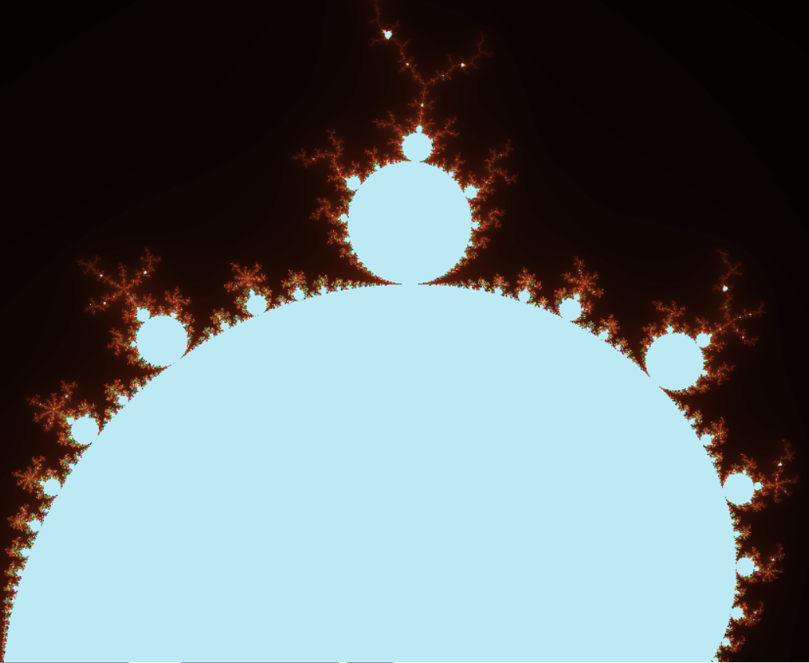

# fractal
Simple code / complex system - mandelbrot

This simple mandelbrot was inspired by 'brainxyz.com'

With added input fields for z00m and shape , a render button to activate the changes.

clicking the image rotates thru 90 degrees...

written by hand in notepad++

As an exersize in complexity from simplicity.

 
